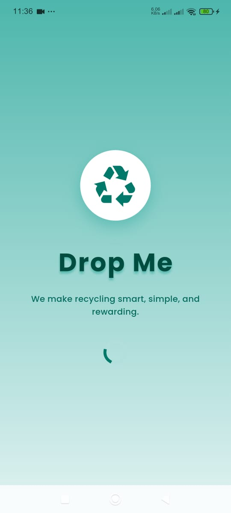
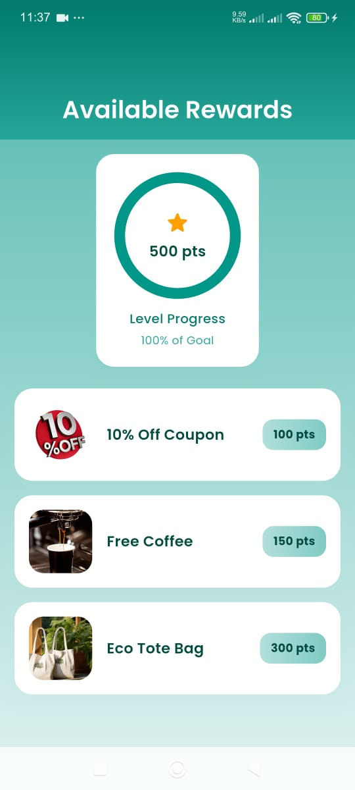
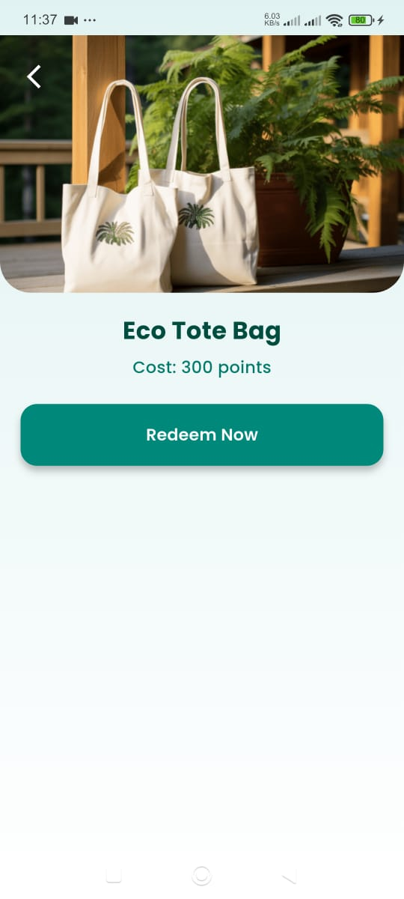
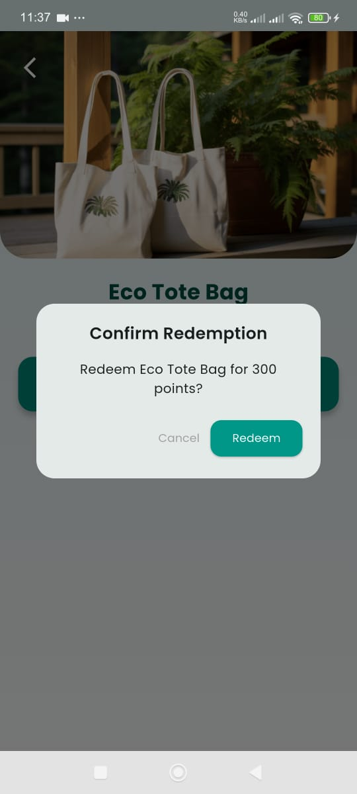

# reward_redemption
A Flutter project implementing the Reward Redemption Flow task for Drop Me’s Flutter Developer Intern application.
Overview

This project includes a 2–3 screen flow allowing users to browse available rewards, view details, and redeem rewards using points.
It also features a custom Splash Screen to reflect Drop Me’s identity as an Egyptian startup focused on smart recycling, AI, and behavioral design.

# Key Features

- Splash Screen with animations and brief company description

- Rewards List Screen with images, names, and point costs

- Reward Details Screen with redeem button and confirmation modal

- Clean state management using BLoC

- Modern UI with gradients, neumorphic cards, and fluid animations

# Getting Started

   **Flutter Version:** 3.29.3  

Follow these steps to run the project locally:

1. Clone the repository
   
   git clone https://github.com/soha131/Reward-Redemption.git
   
   cd drop-me-task

3. Install dependencies
   
   flutter pub get

4. Font Setup
   
   Using the Google Fonts package requires an internet connection.

    Poppins-Regular.ttf

      Poppins-SemiBold.ttf

      Poppins-Bold.ttf
   
     
5. Run the App
flutter run

# Project Structure
lib/screens/       # UI screens 

lib/core/          # BLoC logic

lib/models/        # Data models

assets/     # Screenshots or demo images

# Screenshots / Demo

Video Demo: Watch on Google Drive
[https://drive.google.com/file/d/1VBECt8NbJxthOiKXaUS0BdJeeSwJ5_MD/view?usp=sharing]

 
# Challenges & Solutions

Font Loading: Switched from google_fonts to local fonts to avoid network errors.

Animation Timing: Tuned durations (~600ms) for smoother transitions.

State Edge Cases: Handled “not enough points” gracefully using BLoC and SnackBars.

# Potential Improvements

If I had more time, I would:

-  Add Dark Mode for better accessibility.

- Integrate Drop Me logo and branding visuals.

- Support multi-language using flutter_localizations.

- Add subtle haptic feedback for button interactions.

- Include filtering/sorting in the Rewards List for personalization.

# Notes

The app uses mock data; API integration was not required.

Tested on both Android emulator and physical devices.

Focused on clean code, user experience, and Drop Me’s vision of smart recycling.
